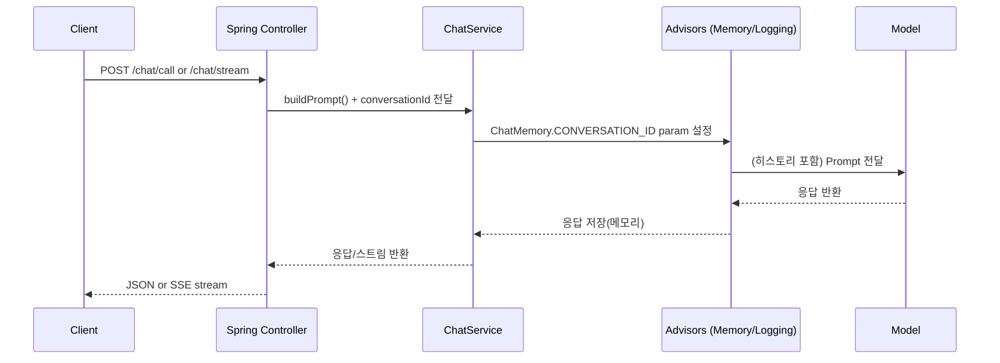

# 🤖 Spring AI Chatbot (REST + SSE Stream + CLI)
### Spring AI(ChatClient/Prompt/Advisor)로 만드는 멀티 모델(OpenAI 호환 / Ollama) 챗봇 스타터

이 프로젝트는 **Spring AI (Spring Artificial Intelligence)** 를 사용해  
**대화형 챗봇**을 REST API와 CLI로 제공하는 예제입니다.

핵심은 모델 SDK에 직접 의존하지 않고, Spring AI의 **ChatClient / Prompt / Message / Advisor** 구조로
**프롬프트 구성, 대화 메모리(문맥 유지), 스트리밍 응답**을 표준 방식으로 구현하는 것입니다.

---

## ✨ Key Features

- **REST API 기반 챗봇 호출**
  - 단건 응답: `POST /chat/call`
  - 스트리밍(SSE): `POST /chat/stream`
- **대화 메모리(ChatMemory)로 문맥 유지**
  - `conversationId` 기준으로 히스토리 연결
  - `MessageWindowChatMemory(maxMessages=10)`로 최근 N개 메시지만 유지
- **Advisor 플러그인 방식**
  - `MessageChatMemoryAdvisor`: 메모리 자동 주입/저장
  - `SimpleLoggerAdvisor`: 요청/응답 로깅(디버깅)
- **System Prompt 지원**
  - `systemPrompt`가 비어있지 않으면 `SystemMessage`로 추가
- **멀티 모델 구성 가능**
  - OpenAI 호환 엔드포인트 설정(`spring.ai.openai.*`)
  - Ollama 로컬 모델 설정(`spring.ai.ollama.*`)
- **CLI 모드 제공**
  - `spring.application.cli=true`로 콘솔 대화 실행
- **OpenAPI(Swagger UI) 포함**
  - springdoc 기반 API 테스트/문서화

---

## 🧭 Architecture

```text
Client (REST/CLI)
   ↓
Controller
   ↓
ChatService
   ↓ (Advisors: Memory + Logging)
Spring AI ChatClient
   ↓
Model Provider (OpenAI compatible / Ollama)
```

---

## 🔄 Sequence Diagram



---

## 🛰 API Endpoints

### 1) Chat Call (JSON)
`POST /chat/call`  
요청 본문으로 Prompt를 구성한 뒤 `ChatResponse`를 반환합니다.

**Request Body**
```json
{
  "conversationId": "user-1",
  "userPrompt": "안녕! 너 누구야?",
  "systemPrompt": "너는 친절한 도우미야",
  "chatOptions": {
    "temperature": 0.7
  }
}
```

**cURL**
```bash
curl -X POST "http://localhost:8080/chat/call"   -H "Content-Type: application/json"   -d '{
    "conversationId":"user-1",
    "userPrompt":"안녕! 너 누구야?",
    "systemPrompt":"너는 친절한 도우미야",
    "chatOptions": { "temperature": 0.7 }
  }'
```

---

### 2) Chat Stream (SSE)
`POST /chat/stream`  
토큰이 생성되는 즉시 `text/event-stream`으로 전송합니다(타이핑처럼 출력).

**cURL**
```bash
curl -N -X POST "http://localhost:8080/chat/stream"   -H "Content-Type: application/json"   -d '{
    "conversationId":"user-1",
    "userPrompt":"한 문장으로 Spring AI를 설명해줘",
    "systemPrompt":"짧고 명확하게 답해",
    "chatOptions": { "temperature": 0.2 }
  }'
```

---

### 3) Quick Test Endpoints
(코드의 `SimpleChatController` 기준)

- `GET /ai?userPrompt=...` → content 문자열만 반환  
- `GET /call?userPrompt=...` → `ChatResponse` 반환  
- `GET /stream?userPrompt=...` → SSE stream

---

## 🧠 How Memory Works (핵심 개념)

이 프로젝트는 “대화 내용을 직접 DB에 저장하고 꺼내는 방식”이 아니라,  
**Advisor가 자동으로 대화 히스토리를 주입하고 저장**합니다.

- `conversationId`를 요청마다 동일하게 주면 → 이전 대화가 이어짐
- `maxMessages=10`이라서 → 최근 10개까지만 문맥으로 유지

비유하면:  
**conversationId = 같은 채팅방**, ChatMemory = **채팅방의 최근 대화 10줄**이라고 생각하면 이해가 빨라요.

---

## ⚙️ Configuration

### 필수 환경변수(OpenAI 사용 시)
```bash
export OPENAI_API_KEY="YOUR_KEY"
```

### application.properties 핵심 설정 예시

#### OpenAI 호환 엔드포인트
```properties
spring.ai.openai.api-key=${OPENAI_API_KEY}
spring.ai.openai.chat.options.model=openai/gpt-4.1-nano
spring.ai.openai.chat.base-url=https://models.github.ai/inference
spring.ai.openai.chat.completions-path=/chat/completions
```

#### Ollama 로컬 모델
```properties
spring.ai.model.chat=ollama
spring.ai.ollama.chat.options.model=hf.co/rippertnt/HyperCLOVAX-SEED-Text-Instruct-1.5B-Q4_K_M-GGUF
spring.ai.ollama.init.pull-model-strategy=when_missing
```

> 권장: OpenAI/Ollama 설정을 **프로파일로 분리**하면 더 깔끔합니다.  
> 예) `application-openai.properties`, `application-ollama.properties` + `--spring.profiles.active=openai`

---

## ▶️ Run

### 서버 실행
```bash
./gradlew bootRun
```

### CLI 모드 실행
`application.properties`에서:
```properties
spring.application.cli=true
```

실행 후 콘솔에서 대화:
```text
User: 안녕
Assistant: ...
```

---

## 🧪 Swagger UI (OpenAPI)

springdoc이 포함되어 있어 로컬 실행 후 Swagger UI로 API를 테스트할 수 있습니다.

- 일반적으로: `/swagger-ui/index.html`

---

## 🛠 Tech Stack

- Java 21
- Spring Boot 3.5.9
- Spring AI 1.1.2
- Model Providers: OpenAI compatible endpoint / Ollama
- springdoc-openapi (Swagger UI)

---

## ✅ Why Spring AI?

Spring AI의 장점은 “모델 호출”을 넘어 챗봇을 **소프트웨어답게** 만들기 위한 표준 구조를 제공한다는 점입니다.

- 모델 교체가 쉬움 (ChatClient 추상화)
- Prompt/Message 타입이 명확해 관리가 쉬움
- Memory/Logging 같은 관심사를 Advisor로 분리
- 스트리밍까지 프레임워크 레벨로 지원

---

## 📌 Roadmap

- Conversation 별 시스템 프롬프트 템플릿 관리
- Redis 기반 외부 ChatMemory(멀티 인스턴스 확장)
- Function Calling(툴 호출) 기반 업무 자동화 챗봇 확장
- Observability(요청/응답 토큰, latency) 메트릭 추가
